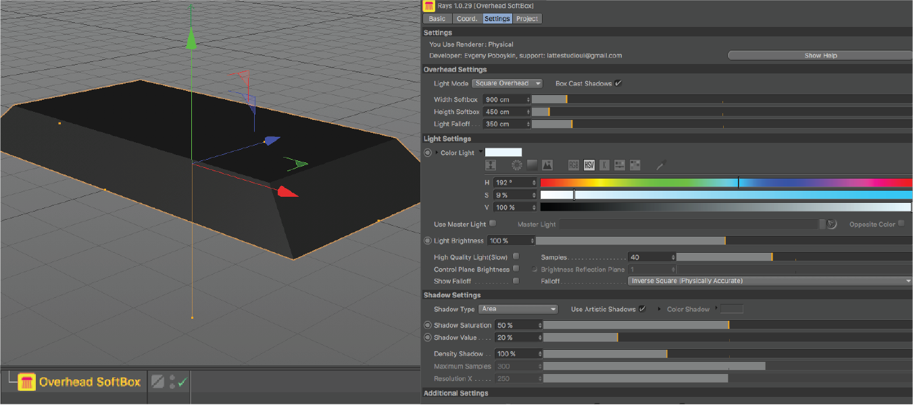
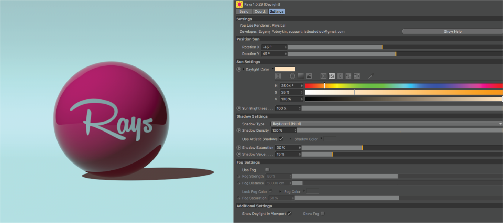

## Rays v 1.0.29

### Plug-in for Cinema 4D R16-19

### Author/Developer Evgeny Poboykin

### OS

-   Description Rays 1.0.29
-   Platform: x86/x64
-   OS: MacOS & PC
-   Version Cinema 4D: R16-19
-   Version Rays: 1.0.29

### Support Renderer

Standard, Physical

### About

8 tools for lighting 3d scenes in a Cinema 4D:

### Lights

BounceCard

Softbox

Overhead

Global Light

Daylight,

Sky

### Surface

Floor

Studio

### Render Test

